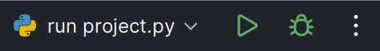

# DBMS Query Execution Plan

## Project Overview
The broad aims of the project are as follows:
- Retrieve and visualize the QEP of a given SQL query.
- Support what-if queries on the QEP by enabling interactive modification of the physical operators and join order in the visual tree view of the QEP to generate an AQP.
- Retrieve the estimated cost of the AQP and compare its cost with the QEP.

## Prerequisites
- Python 3.10
- pip (Python package installer)

## Setup Instructions

### 1. Clone the Repository
```sh
git clone https://github.com/xeroxis-xs/DBMS-QueryExecutionPlan-Python.git
cd DBMS-QueryExecutionPlan-Python
```

### 2. Create a Virtual Environment
```sh
python -m venv venv
source venv/bin/activate  # On Windows use `venv\Scripts\activate`
```

### 3. Install the Required Packages
Install the required Python packages using `pip`.
```sh
pip install -r requirements.txt
```

### 4. Run the Project
Execute the main script to start the project.
```sh
python project.py
```

Or, if you are using PyCharm, you can click on the green play button in the top right corner of the editor.  
</img>