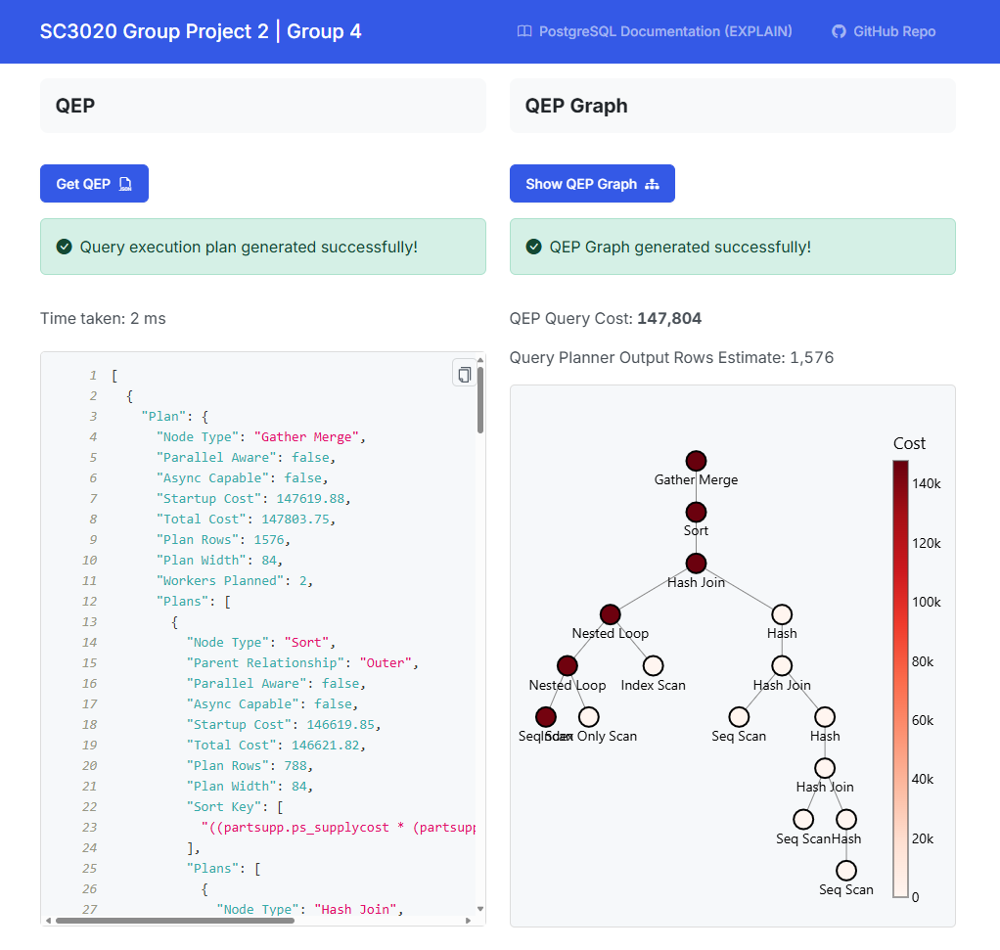
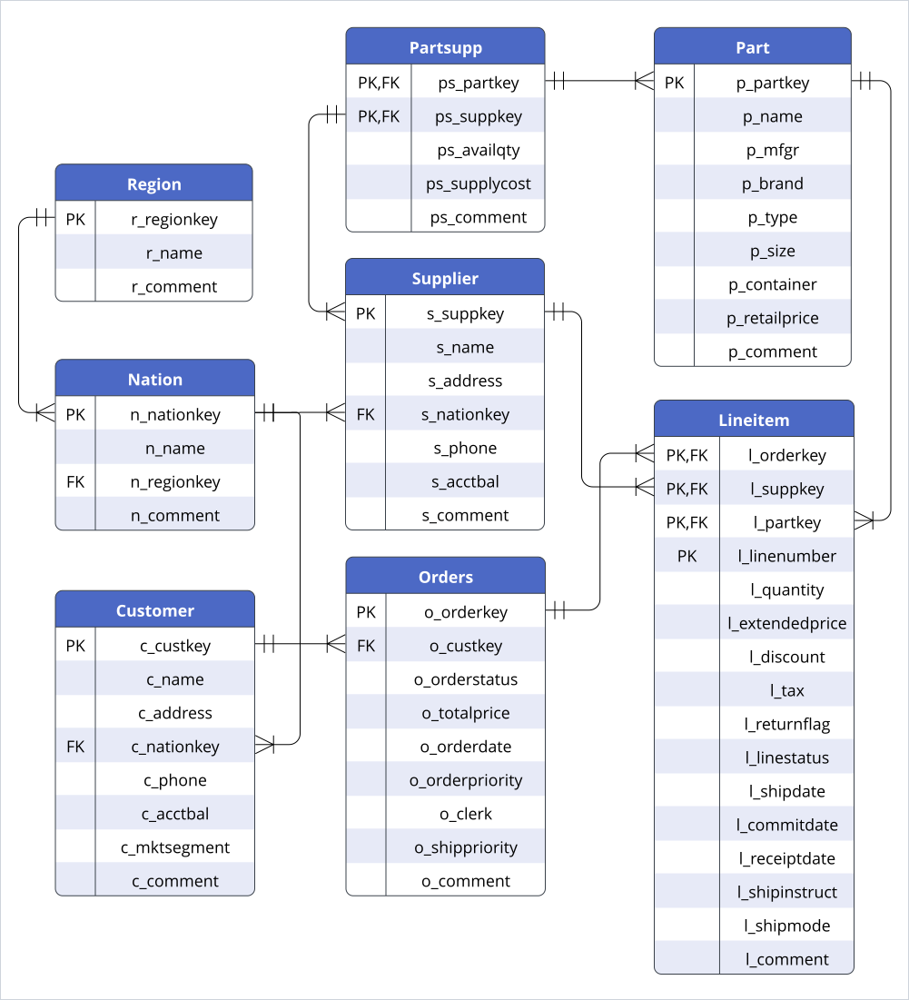

# DBMS Query Execution Plan

## Project Overview
The broad aims of the project are as follows:
- Retrieve and visualize the QEP of a given SQL query.
- Support what-if queries on the QEP by enabling interactive modification of the physical operators and join order in the visual tree view of the QEP to generate an AQP.
- Retrieve the estimated cost of the AQP and compare its cost with the QEP.

## Preview
</img>

## ERD
</img>

## Prerequisites
- Python 3.10
- pip (Python package installer)
- Git LFS (Large File Storage) - [Download](https://git-lfs.github.com/)
- PostgreSQL Server - [Download](https://www.postgresql.org/download/)

## Setup Instructions
If you already have the TPC-H database setup, you can skip and just clone the repo and perform [step 9](#9-create-a-virtual-environment), [step 10](#10-install-the-required-packages), and [step 12](#12-run-the-project) to run the project without using Git LFS.

### 1. Install Git LFS
Download and install Git LFS from the link provided above

### 2. Initialize Git LFS
Run the following command to initialize Git LFS
```sh
git lfs install
```

### 3. Clone the Repository
```sh
git clone https://github.com/xeroxis-xs/DBMS-QueryExecutionPlan-Python.git
cd DBMS-QueryExecutionPlan-Python
```

### 4. Check if PostgreSQL is Installed
Run the following command to check if PostgreSQL is installed.
```sh
postgres --version
```

### 5. Start the PostgreSQL Server
Start the PostgreSQL server by starting ```pgAdmin``` app or running the following command.

**MacOS**:
```sh
sudo service postgresql start
```
**Windows**:

Go to start > Services > postgresql-x64 > Start

### 6. Connect to your PostgreSQL Server
In `pgAdmin`, select the default `PostgreSQL 17` server and connect to it.

Alternatively, use the following command to connect to the default server.
```sh
psql -U <your_username> -h localhost -p <your_port>
```

### 7. Create a new Database
Create a new database via the PostgreSQL command line or pgAdmin.
```sh
CREATE DATABASE your_database_name;
```

### 8. Set Up the `.env` File
Create a new file named `.env` in the root directory of the project and add the following environment variables.
```sh
DB_NAME=your_database_name
DB_USER=your_username
DB_PASSWORD=your_password
DB_HOST=localhost
DB_PORT=your_port  # Default PostgreSQL port is 5432
```

### 9. Create a Virtual Environment
```sh
python -m venv venv
source venv/bin/activate  # On Windows use `venv\Scripts\activate`
```

### 10. Install the Required Packages
Install the required Python packages using `pip`.
```sh
pip install -r requirements.txt
```

### 11. Populate the Database
Run the following command to populate the database with the required tables and data.
```sh
python -m db.populate
```

### 12. Run the Project
Execute the main script to populate the database and start the project.
```sh
python -m project
```
